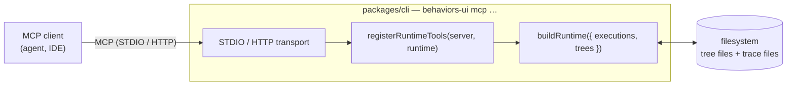
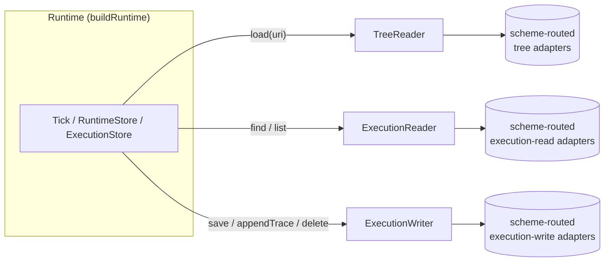
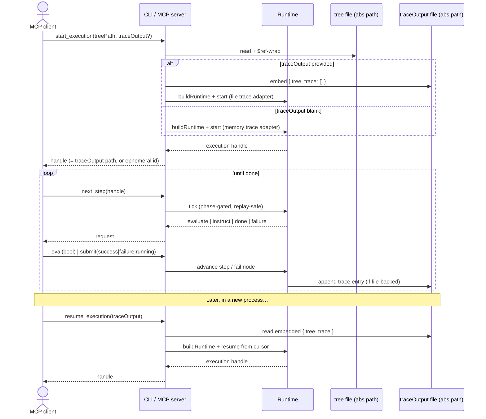
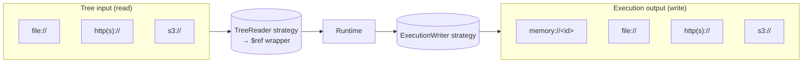

# MCP server for the runtime

Expose `@behaviors-ui/runtime` from the `@behaviors-ui/cli` package as a Model Context Protocol server so that external agents can drive behaviour-tree executions. Two transports are in scope: STDIO first, then HTTP.

## Architecture



- `@modelcontextprotocol/sdk` provides `Server`, `StdioServerTransport`, and an HTTP/SSE transport.
- The runtime is constructed once per CLI process via `buildRuntime` from `packages/runtime/src/runtime.ts`.
- Tool registration is shared between transports: a `registerRuntimeTools(server, runtime)` helper lives in `packages/cli/src/mcp/` and is called by both the STDIO and HTTP entrypoints.

### Port split (CQRS-ish)

The runtime's hexagonal ports are split along read vs write boundaries, because at scale the consistency model on each side differs (e.g. read replicas, caches, eventual-consistency stores for traces; strong consistency for the current cursor). Today `packages/runtime/src/ports/` has `TreeSource` and a combined `ExecutionRepository` — the work is to refactor into three ports:



| Port              | Methods (sketch)                                                | Notes                                                                                                          |
| ----------------- | --------------------------------------------------------------- | -------------------------------------------------------------------------------------------------------------- |
| `TreeReader`      | `load(uri): Promise<LoadedTree \| null>`                        | Renames `TreeSource`. The `arg: string` becomes a typed URI, with the implementation routing by scheme.        |
| `ExecutionReader` | `findByUri(uri)`, `list()`                                      | Read-only half of today's `ExecutionRepository`. Implementations may hit a replica / cache.                    |
| `ExecutionWriter` | `create(doc)`, `appendTrace(uri, entry)`, `update(doc)`, `delete(uri)` | Write-only half. Implementations own the consistency contract (atomic file write, multipart S3, HTTP PATCH…). |

Why a separate `appendTrace`: traces are the high-frequency write path; lifting it out of `save(wholeDoc)` lets writers stream/append without rewriting the full document on every tick.

`buildRuntime` takes all three:

```ts
buildRuntime({
  trees: TreeReader,
  executionsRead: ExecutionReader,
  executionsWrite: ExecutionWriter,
});
```

The CLI defaults wire all three to scheme-routing adapters in `packages/cli/src/mcp/io/` (per the URI-based I/O contract below), but tests and alternative deployments can swap them independently — e.g. an in-memory reader against a durable writer, or vice versa.

## Execution lifecycle



## CLI surface

Add to `packages/cli/src/index.ts`:

- `behaviors-ui mcp` — STDIO transport (no port, no logging to stdout — logs go to stderr).
- `behaviors-ui mcp --http [--port <n>] [--host <name>]` — HTTP/SSE transport. Either mount on the existing `@behaviors-ui/server` Bun server under `/mcp` or run a standalone listener; pick one and document it in code comments.

## Tool surface

Everything is path-driven. The MCP layer does **not** browse, enumerate, or "list" anything — there are no discovery tools. Callers always pass URIs in, and the runtime writes to URIs out. There is no execution-id registry on the server side; the URI **is** the execution handle.

The driving verbs mirror the abtree runtime protocol — `next_step` is replay-safe, the phase machine (`idle | evaluating | performing | protocol`) gates which verb is valid next, and a synthetic `Acknowledge_Protocol` instruct is surfaced before any tree work until the agent submits success to it.

| Group | Tool | Notes |
| ----- | ---- | ----- |
| Lifecycle | `start_execution(tree_uri, trace_output)` | Embeds the resolved tree into the doc. Fails if `trace_output` already exists — use `resume_execution`. New execs begin with `protocol_accepted: false`. |
| Lifecycle | `resume_execution(trace_output)` | Confirms an existing doc can be driven. No `tree_uri` — the tree lives on the doc. |
| Lifecycle | `reset_execution(trace_output)` | Rewinds trace, scopes, runtime bookkeeping, and re-arms the protocol gate. |
| Loop | `next_step(trace_output)` | Returns the next `evaluate` / `instruct`, or `{ status: "done" \| "failure" }`. Replay-safe while phase ∈ { evaluating, performing, protocol }. |
| Loop | `eval(trace_output, result: bool, note?)` | `true` advances `step_index += 1`; `false` marks the action a failure. |
| Loop | `submit(trace_output, status: success\|failure\|running, note?)` | `success` advances within the action (closing it on the last step); `failure` fails the action; `running` is a yield. |
| Loop | `think(trace_output, thought)` | Append a checkpoint trace entry without advancing the cursor. |
| Scope | `var_read(trace_output, path?)` | Read $VAR. Omit `path` for the whole scope. |
| Scope | `var_write(trace_output, path, value)` | JSON-parse-or-string write. |
| Scope | `const_read(trace_output, path?)` | Read $CONST. Seeded once at create from `tree.state.const`. |
| Inspect | `get_execution(trace_output)` | Full document. |
| Inspect | `read_trace(trace_output, from?, to?)` | Trace slice. |

Implementation lives in `packages/cli/src/mcp/verbs.ts` (the orchestration) and `register-runtime-tools.ts` (thin MCP shims). The verbs module owns the phase machine; the runtime ports stay pure CRUD.

### URI-based I/O contract

Tree **inputs** and execution **outputs** are addressed by URI, with the scheme selecting the reader/writer adapter. This keeps the tool surface polymorphic — the CLI/MCP layer doesn't care where a tree comes from or where a trace lands.

**The system never mints identifiers.** Tree URIs and execution URIs are always supplied by the caller — there is no server-side id generation, no auto-incrementing handle, no fallback default. If a caller wants two parallel in-memory executions, they choose two distinct `memory://` addresses; if they want to overwrite a previous run, they reuse the same URI (and accept the "already exists" error from `start_execution`, falling back to `resume_execution`).



**Tree-input URIs.** `start_execution` takes a `tree` URI. The CLI selects a reader by scheme, fetches the bytes, parses, and wraps the resolved tree into a `$ref` shape before handing it to the runtime, e.g.:

```json
{ "$ref": "file:///abs/path/to/tree.yaml" }
```

Initial readers:

| Scheme               | Reader               | Notes                                               |
| -------------------- | -------------------- | --------------------------------------------------- |
| `file://`            | FilesystemTreeReader | Default; absolute paths only.                       |
| `http://` `https://` | HttpTreeReader       | GET with content-type sniff (yaml vs json).         |
| `s3://`              | S3TreeReader         | Uses ambient AWS creds; bucket+key parsed from URI. |

**Execution-output URIs.** `start_execution` requires a `traceOutput` URI; the scheme selects the writer. There is no implicit/blank case — even the in-memory writer is addressed explicitly via `memory://<caller-chosen-id>` so callers can find and resume their executions later.

| Scheme               | Writer                  | Notes                                                              |
| -------------------- | ----------------------- | ------------------------------------------------------------------ |
| `memory://<id>`      | InMemoryExecutionWriter | Process-lifetime only; resumable within the process by `<id>`.     |
| `file://`            | FileExecutionWriter     | Embed `{ tree, trace }` doc at the path; append on tick.           |
| `http://` `https://` | HttpExecutionWriter     | POST/PUT the doc, PATCH/POST trace deltas on tick.                 |
| `s3://`              | S3ExecutionWriter       | PutObject on start; PutObject (or multipart append) on tick.       |

Reader/writer registration lives in `packages/cli/src/mcp/io/` so new schemes (e.g. `gs://`, `gcs://`) can be added without touching the tool layer.

### Execution document schema

The single source of truth for the **execution output format** lives in `@behaviors-ui/spec` as `execution.ts`, parallel to the existing `tree.ts` / `workspace.ts`. Today the equivalent types live in `packages/runtime/src/types.ts` (`ExecutionRow`, `ExecutionDoc`, `TraceEntry`, `RuntimeState`, `NodeStatus`, `TickResult`) — that work is to lift the schema into spec and have the runtime `import type` from spec (the way it already does for `BehaviourNode` / `Step`).

Top-level shape of an execution document (what a `file://` writer would serialize to disk and what `resume_execution` reads back):

```ts
// packages/spec/src/execution.ts (target)
import type { BehaviourNode, ParsedTree, TraceKind } from "./tree";

export interface TraceEntry {
  ts: string;            // ISO-8601
  kind: TraceKind;       // "evaluate" | "instruct" | "protocol" | "think"
  cursor: string;        // dotted node path, e.g. "0.1.2"
  name: string;          // node name at cursor
  submitted: string;     // what the agent submitted
  outcome: string;       // engine outcome string
  note?: string;         // free-text reasoning (ignored by engine)
}

export type NodeStatus = "success" | "failure" | "running";

export interface RuntimeState {
  node_status: Record<string, NodeStatus>;
  step_index: Record<string, number>;
  retry_count: Record<string, number>;
}

export interface ExecutionDocument {
  // --- identity / provenance ---
  // Both URIs are caller-supplied; the system does not generate either.
  uri: string;                 // execution URI the caller passed to start_execution (memory://… | file://… | https://… | s3://…)
  schema_version: 1;           // bump on breaking changes
  created_at: string;          // ISO-8601
  updated_at: string;          // ISO-8601

  // --- input snapshot (embedded so the doc is self-contained) ---
  tree_uri: string;            // the original tree URI the caller passed
  tree: ParsedTree;            // resolved + normalized tree, frozen at create

  // --- execution state ---
  status: string;              // "running" | "done" | "failure" | …
  phase: string;
  cursor: string;
  protocol_accepted: boolean;

  // --- scopes ---
  var: Record<string, unknown>;    // mutable scope
  const: Record<string, unknown>;  // seeded from tree.state.const at create; never mutated

  // --- engine bookkeeping ---
  runtime: RuntimeState;

  // --- append-only audit log ---
  trace: TraceEntry[];
}
```

Notes:

- `uri` and `tree_uri` are both whatever the caller passed; the system never mints them. The doc is keyed/addressed by `uri`, which equals the `traceOutput` argument to `start_execution`.
- `tree` is the **resolved** tree (post-`$ref` deref, post-normalize), so resuming never needs network or filesystem access for the tree itself.
- `trace` is append-only; writers should support a fast-path append (e.g. `FileExecutionWriter` opens the file in append mode for the trace array, or rewrites the doc atomically per tick — pick one and document).
- `schema_version` exists so future format changes are detectable; bump deliberately.

## Out of scope (for the first cut)

- Auth on the HTTP transport (assume localhost only).
- Streaming partial tick results — return full `TickResult` per call.
- Workspace mutation tools (creating/editing trees via MCP) — read-only + execute only.

## Key files

- `packages/cli/src/index.ts` — CLI entrypoint, add `mcp` subcommand.
- `packages/cli/package.json` — add `@behaviors-ui/runtime` and `@modelcontextprotocol/sdk`.
- `packages/cli/src/mcp/` (new) — `register-runtime-tools.ts`, `stdio.ts`, `http.ts`.
- `packages/runtime/src/index.ts` — public runtime surface (already exports everything we need).
- `packages/runtime/src/runtime.ts` — `buildRuntime` factory.
- `packages/runtime/src/adapters/fs-paths.ts` — default storage locations.
